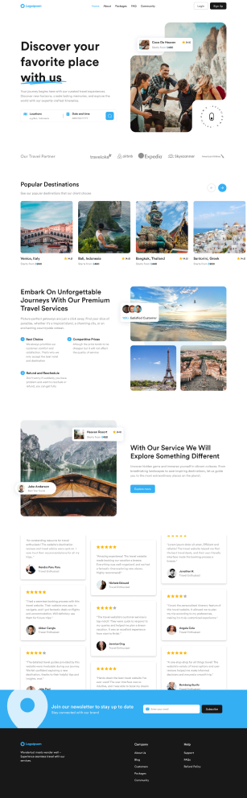

# Travel-Agent
[Demo](https://pvlchupryna.github.io/Travel-Agent/)
<table>
    <tr>
        <td valign="top" style="vertical-align: top;">
            <h4>Technologies:</h4>
            

              
              
              
              
            

                

            <ul>
                <h4>Description:<h4>
                <li>Responsive design to 320px</li>
                <li>Menu Item Activation on Scroll</li>
                <li>Form validation</li>
                <li>Autocomplete</li>
                <li>Datepicker</li>
                <li>Sticky Header</li>
                <li>Hover Effects</li>
                <li>Slider</li>
            </ul>
        </td>
        <td style="margin-left: 200px;">
           
        </td>
    </tr>
</table>
